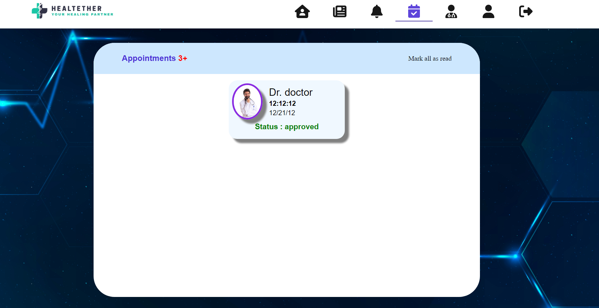

# WECare
## Tech Stack

*Client:* React JS

*Server:* Node JS, Express JS

*Database:* Mongo DB
  
## Run Locally

Steps to run the project locally 

1. Create new Folder and name it according to your convience(Eg. health)
2. Use command git clone "https://github.com/Pacific077/Health.git" and downlaod the project locally
3. You wil find that you have two folders in Health Folder
4. Open the Health Folder in vs code
5. Open the terminal
6. Navigate to Backend by using "cd backend" command
7. Install necessary pakage by using command "npm i"
8. Intall these python libraries
  -> pip install BeautifulSoup
  -> pip install numpy
  -> pip install pandas
9. Now move back on folder by using cd ..
10. Navigate to frontned folder by using cd frontend
11. Use npm i --legacy-peer-deps

Start the Server from root directory

bash
  cd backend/
  npm start

Start the Frontend from root directory

bash
  cd frontend/
  npm start

# Dummy Credentials
Admin: Email-admin@123.com  Password:pass

Doctor: Email-doc@123.com  Password:pass

Patient: Email-pat@123.com  Password:pass

  
# Features

### Authenticaton
Users can register with their name, emailId, password and Profile Picture.

Users can login their account by using their registered credentials.

 

### How to register as a Doctor
After the default registration as patient has been completed, user can apply for Doctor Role.

*Click on Apply Now

After successfull submission of form, Admin will recieve the request.

Once the admin approves the application the user will be registered as a Doctor.

### Dashboard

Users can see their profile details in their dashboard.
Users can also update their Profile Picture.

### Notification System

Users are able to get latest updates through Notification.

### Appointment System

Any patient or Doctor can send an appointment request to any doctors from the Doctor's list as required.

Doctors can view pending appointment requests and can approve or reject the same as per their schedule.

If approved or rejected, user will receive a notification about it.
Their is a section in Navbar to view upcoming appointments.

### Disease Prediction

Users can perform an online diagnosis by answering questions related to 132 different symptoms.

45 different diseases can be diagnosed with an accuracy of 100%

### Latest News and Tips for better Health

Section available for reading latest news and tips about maintaining a healthy lifestyle.

### Health Library

A online library to read about topic related to fitness and health.

## Made By and Contribution

Md Faisal Rahman

Palak Thakur

Ankur Kumar
